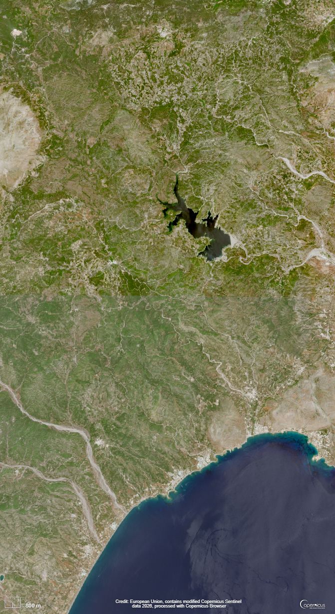
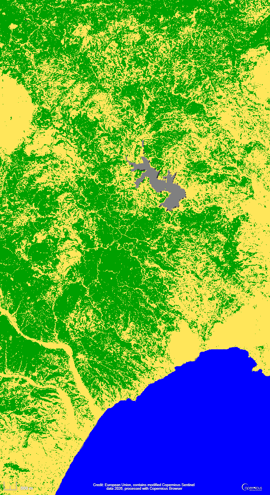
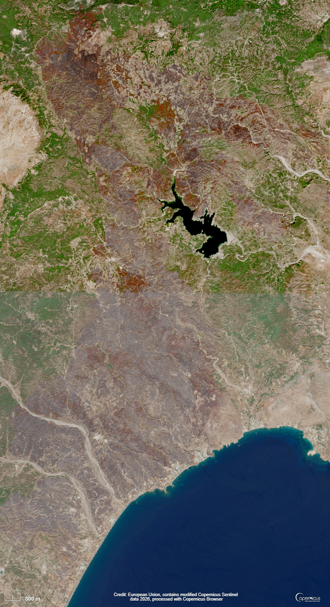
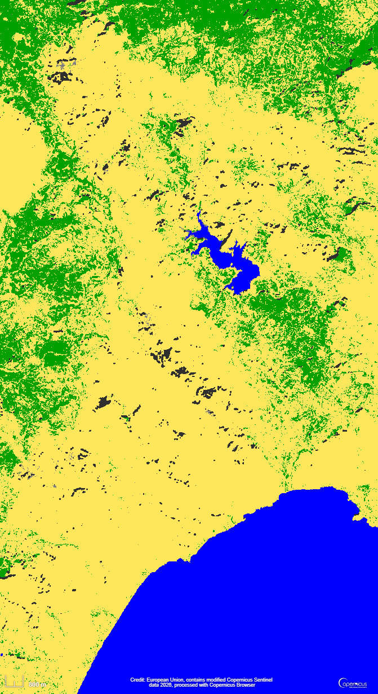
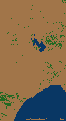
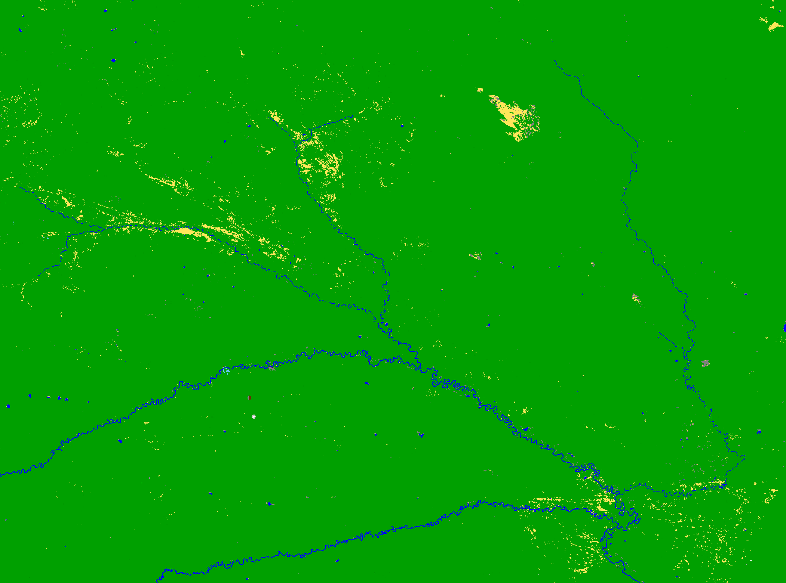
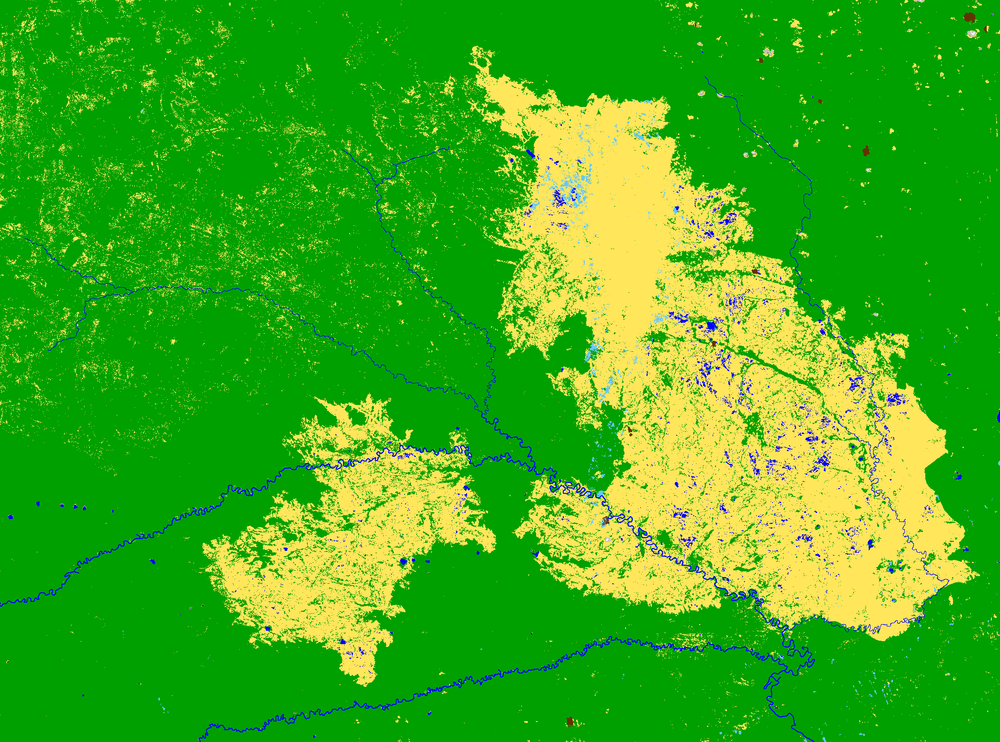
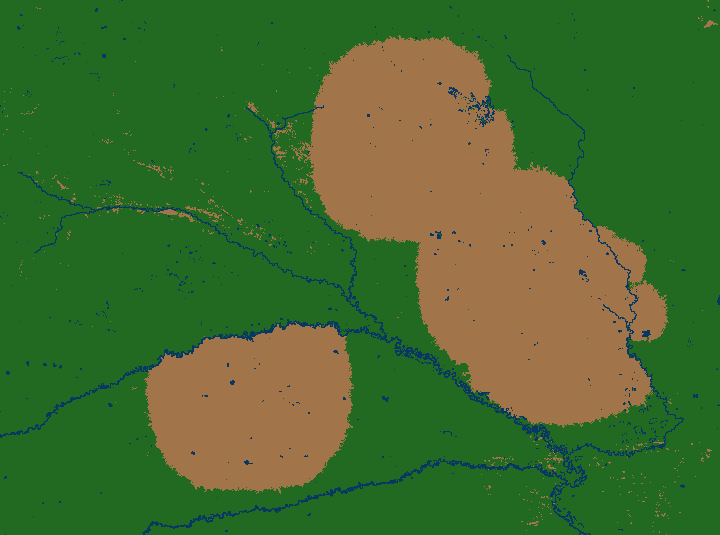

# Modelowanie i symulacja pożarów lasów

## Autorzy

- Łukasz Wilański
- Kuba Ciszewski

## 1. Wstęp

Pożary lasów są jednym z najpoważniejszych zagrożeń środowiskowych współczesnego świata. Występują na wielu kontynentach i prowadzą do ogromnych strat ekologicznych, gospodarczych oraz społecznych. Ich skutki obejmują niszczenie ekosystemów, emisję dużych ilości dwutlenku węgla, degradację gleby, zagrożenie dla ludzi i zwierząt, a także wysokie koszty akcji ratowniczych oraz odbudowy zniszczonych terenów.

Zjawisko pożaru lasu jest trudne do przewidzenia, ponieważ zależy od wielu czynników działających jednocześnie. Na tempo rozprzestrzeniania się ognia wpływają między innymi rodzaj i gęstość roślinności, wilgotność, wiatr, opady deszczu, ukształtowanie terenu oraz działania człowieka. Z tego powodu analiza rzeczywistych pożarów wymaga nie tylko obserwacji danych historycznych, ale również tworzenia modeli, które pozwalają badać różne scenariusze rozwoju pożaru.

Symulowanie pożarów jest istotne, ponieważ umożliwia lepsze zrozumienie mechanizmów odpowiedzialnych za rozprzestrzenianie się ognia. Dzięki modelom symulacyjnym można sprawdzać, jak zmiana warunków środowiskowych wpływa na końcowy zasięg pożaru, które parametry są najważniejsze dla powstawania dużych pożarów oraz jakie działania mogą ograniczyć ryzyko rozprzestrzeniania się ognia.

## 2. Model symulacyjny

W projekcie wykorzystano model oparty na automacie komórkowym. Obszar symulacji reprezentowany jest jako dwuwymiarowa siatka komórek, gdzie każda komórka odpowiada fragmentowi terenu. W zależności od danych wejściowych komórka może oznaczać na przykład drzewo, teren pusty, wodę lub komórkę znajdującą się w jednym z etapów spalania.

Inspiracją dla projektu był klasyczny model Drossela-Schwabla, czyli jeden z najbardziej znanych automatów komórkowych służących do badania pożarów lasów i zjawisk samoorganizującej się krytyczności. Więcej informacji o tym modelu można znaleźć między innymi w pracy: [Critical Behaviour of the Drossel-Schwabl Forest Fire Model](https://arxiv.org/abs/cond-mat/0202022).

Klasyczny model został przez nas rozszerzony o dodatkowe elementy, które pozwalają lepiej odwzorować wybrane aspekty rzeczywistych pożarów. W szczególności uwzględniono wpływ wiatru w jednym z ośmiu kierunków, wpływ deszczu występującego w określonych przedziałach czasu, różne etapy spalania komórki, czas trwania poszczególnych etapów spalania oraz różne prawdopodobieństwa rozprzestrzeniania się ognia w zależności od stanu komórki.

## 3. Dane rzeczywiste i walidacja modelu

Jednym z celów projektu było sprawdzenie, czy symulacja może odtworzyć przebieg rzeczywistych pożarów. W tym celu wybrano konkretne pożary, dla których możliwe było pozyskanie danych satelitarnych sprzed i po zdarzeniu.

Proces walidacji składał się z kilku etapów. Najpierw wybierany był pożar o znanej lokalizacji oraz przybliżonym czasie trwania. Następnie pobierano zdjęcia satelitarne obszaru sprzed pożaru i po pożarze. Do tego wykorzystano dane dostępne przez serwis Copernicus, który umożliwia analizę obrazów satelitarnych i tworzenie map klasyfikacji terenu.

Na podstawie zdjęć satelitarnych generowano mapy wegetacji. Dzięki nim możliwe było odróżnienie terenów zalesionych od obszarów niezalesionych, wody oraz terenów spalonych. Mapa wegetacji sprzed pożaru była wykorzystywana jako grid startowy symulacji, natomiast mapa po pożarze służyła jako grid referencyjny, z którym porównywano wynik symulacji.

## 4. Wersje symulacji

W projekcie przygotowano dwie wersje symulacji.

Pierwsza wersja to symulacja wizualna z interfejsem napisanym w PyGame. Umożliwia ona obserwowanie rozprzestrzeniania się ognia na planszy w czasie rzeczywistym. W tej wersji widoczne są różne typy komórek, takie jak drzewa, woda, ogień oraz teren po spaleniu. Do animacji dodano również wizualizację zjawiska deszczu.

Druga wersja to wersja headless, czyli symulacja bez interfejsu graficznego. Została ona przygotowana z myślą o szybkim wykonywaniu wielu uruchomień symulacji. Taka wersja była potrzebna przede wszystkim do strojenia hiperparametrów, ponieważ proces optymalizacji wymagał uruchomienia symulacji wiele razy dla różnych zestawów parametrów.

## 5. Analizowane pożary

W projekcie skupiono się na dwóch rzeczywistych pożarach.

Pierwszym analizowanym przypadkiem był pożar na greckiej wyspie Rodos w lipcu 2023 roku. Dla tego pożaru udało się pozyskać dokładne dane o początku zdarzenia z NASA FIRMS oraz dane meteorologiczne. Pożar ten był gaszony przez służby, co oznacza, że jego rzeczywisty przebieg był zależny nie tylko od warunków naturalnych, ale również od działań człowieka.

Drugim analizowanym przypadkiem był pożar w okolicach Jakucka w lipcu 2021 roku. W tym przypadku udało się pozyskać dane satelitarne przed i po pożarze, jednak nie udało się uzyskać równie dokładnych danych meteorologicznych jak dla Rodos. Istotną różnicą było również to, że pożar w Jakucku nie był gaszony w takim stopniu jak pożar na Rodos, przez co jego przebieg mógł być bardziej zbliżony do naturalnego rozwoju ognia.

## 6. Metryka jakości symulacji

Do oceny jakości symulacji wykorzystano porównanie obszaru spalonego w symulacji z obszarem spalonym widocznym na mapie satelitarnej po pożarze. W tym celu zastosowano metrykę IoU, czyli Intersection over Union.

Metryka IoU mierzy podobieństwo dwóch masek binarnych. W naszym przypadku porównywana była maska terenów pustych lub spalonych uzyskana z symulacji z analogiczną maską uzyskaną z danych satelitarnych po pożarze. Wartość IoU jest obliczana jako stosunek części wspólnej dwóch masek do ich sumy.

Im większa wartość IoU, tym lepiej wynik symulacji pokrywa się z rzeczywistym obszarem spalonym. Metryka ta pozwala jednocześnie karać sytuacje, w których symulacja spaliła zbyt duży obszar, oraz sytuacje, w których nie odtworzyła obszarów rzeczywiście spalonych.

Oprócz samego kształtu spalonego obszaru brano pod uwagę również czas trwania symulacji. W symulacji przyjęto, że jedna komórka odpowiada obszarowi o wymiarach 120 m x 120 m. Przyjęto również, że jeden krok symulacji odpowiada około 30 minutom czasu rzeczywistego.

## 7. Tuning hiperparametrów

Po opracowaniu sposobu oceny wyników symulacji przeprowadzono strojenie hiperparametrów modelu. Celem optymalizacji było znalezienie takiego zestawu parametrów, który pozwalał jak najlepiej odwzorować rzeczywisty przebieg pożaru.

Łącznie optymalizowano 11 hiperparametrów. Część z nich była parametrami ciągłymi typu float, na przykład prawdopodobieństwo rozprzestrzenienia się ognia lub wpływ wiatru. Inne były parametrami całkowitymi, takimi jak czas zapłonu, czas aktywnego spalania oraz czas tlenia komórki.

Do optymalizacji wykorzystano bibliotekę Optuna oraz sampler TPE, czyli Tree-structured Parzen Estimator. Optymalizacja była wykonywana na superkomputerze Ares.

## 8. Wyniki

### 8.1. Pożar na Rodos, lipiec 2023

#### Zdjęcie satelitarne przed pożarem

#### Mapa wegetacji przed pożarem

#### Zdjęcie satelitarne po pożarze

#### Mapa wegetacji po pożarze

#### Najlepszy wynik symulacji

### 8.2. Pożar w Jakucku, lipiec 2021

#### Zdjęcie satelitarne przed pożarem

#### Mapa wegetacji przed pożarem

#### Zdjęcie satelitarne po pożarze

#### Mapa wegetacji po pożarze

#### Najlepszy wynik symulacji

## 9. Wnioski

W ramach projektu udało się w pewnym stopniu odwzorować przebieg rzeczywistych pożarów lasów na podstawie przygotowanego modelu automatu komórkowego. Dla pożaru na Rodos uzyskano najlepsze dopasowanie na poziomie około 70%, natomiast dla pożaru w Jakucku najlepszy wynik wyniósł około 57%. Oznacza to, że model był w stanie częściowo odtworzyć kształt i zasięg spalonego obszaru, szczególnie po przeprowadzeniu strojenia hiperparametrów.

Jednocześnie należy podkreślić, że rzeczywiste pożary lasów są zjawiskami bardzo złożonymi i zależą od wielu losowych oraz trudnych do zmierzenia czynników. Na ich przebieg wpływają między innymi lokalne warunki pogodowe, zmienność kierunku i siły wiatru, wilgotność roślinności, ukształtowanie terenu, rodzaj paliwa roślinnego oraz działania służb gaśniczych. Wielu z tych czynników nie byliśmy w stanie w pełni uwzględnić w naszej symulacji.

Mimo tych ograniczeń projekt pokazał, że automat komórkowy może być użytecznym narzędziem do przybliżonego modelowania rozprzestrzeniania się pożarów lasów. Uzyskane wyniki potwierdzają, że nawet uproszczony model, po odpowiedniej kalibracji, może odtwarzać ogólne tendencje rozwoju pożaru i stanowić podstawę do dalszych, bardziej zaawansowanych eksperymentów.
